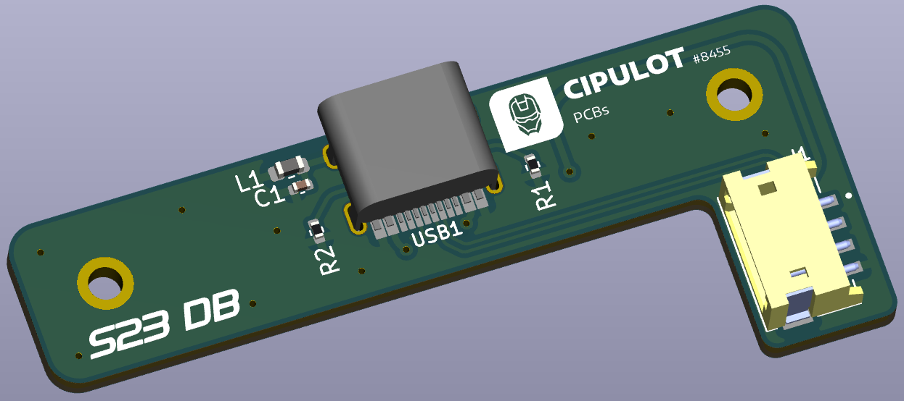

# S23 DB

S23 daughterboard with CC resistors.

There's not much to be said about this board. It's a daughterboard for the S23 by Sho, with the CC resistors to allow full USB-C operations.

The original JST ZH/ZR connector is replaced with one that has horizontal mount anchor points, to avoid mechanical stress on the connector (LCSC part number C485354).

The pinout is marked on the bottom of the PCB for reference.

## License

 This work is licensed under a <a rel="license" href="http://creativecommons.org/licenses/by-nc-sa/4.0/">Creative Commons Attribution-NonCommercial-ShareAlike 4.0 International License</a>.
